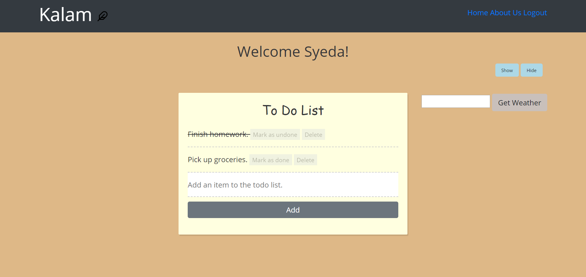
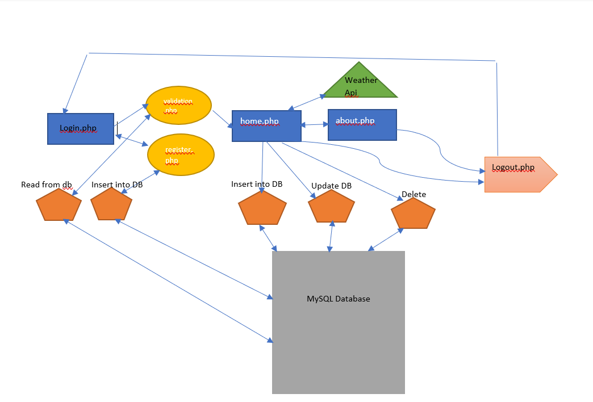
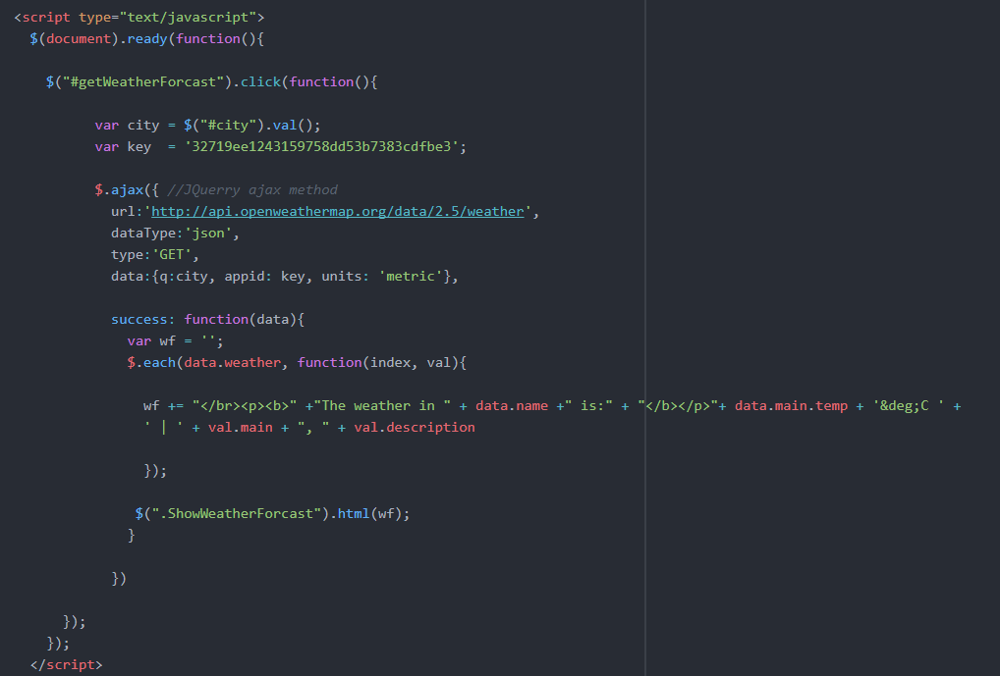

Name: Syeda Zahra

Online Demo: https://blooming-shelf-24846.herokuapp.com/login.php

Project Title: PHP To Do List Application

Instructor: [Ghassem Tofighi](https://ghassem.com/)

License: [MIT Licence](https://opensource.org/licenses/MIT)

# Create a Simple To Do List Web Application using PHP. #


In this developer code pattern, we will create a web application using, PHP, HTML, CSS, Bootstrap, JQuery, phpMyAdmin, and the OpenWeather API. This application allows users to create a to-do list to help them get organised. It also includes a component for them to check the weather based on the city the user is in. 

The app uses a database that stores the entries for the To Do List. The user can mark the items in the list as done which will update the value of the "done" field in the database to a 1, and the item will have a line through it as shown in the photo below. 



Also, if the user accidently marked an item as done, he/she can mark it as undone and the value of "done" will return to 0. In addition to that, the user may also delete the items in the list if he/she feels that the list is getting too cluttered. The app uses all CRUD operations as it creates an entry, it reads the items and displays them on the screen in the to do list, it updates the items, and it deletes them if needed. 

## Watch Video Below for the App Demo and to See How to Navigate the App ##

[](https://www.youtube.com/watch?v=dL5DQM0IZds&feature=youtu.be)

## Flow of the App ##

The figure below shows the overall functional flow of the app.



1. First the user will be required to either register or login. When the user registeres, his/her information is stored onto the database, and when the user logs in the information is "read" from the databse to validate and determine whether the user moves on to the next page.
2. Upon successful login, the user will be redirected to the homepage where the user will be greeted using their username. The homepage also contains the To do List app where the user can add the items to their To Do List. They can update the items by marking them as done/undone or they can delete them from the list by deleting them from the database.
  
      -JQuery was mainly used for the weather component of the app. JQuery features were used to implement buttons that hide or show the weather component. Below is the code for in home.php.

    

      -JQuery's Ajax method was used to use a weather API, get its results and then used the returned data to display the weather when the city is entered and the "Get Weather" button is clicked. 
      Below if the code for this component in home.php.

   
  
      -Bootstrap components were used throughout the app. For instance the button, form, and navigation plugins were used throughout to make the app look more elegant, responsive and aesthetically pleasing.
 
3. The About Us page contains plain text giving a little background about the app.
 
4. Finally clicking Logout in the navigation bar will log the user out of the app.

## Deployment of PHP apps to Heroku: ##

1. Export your database from phpMyAdmin.
2. Go to your project directory and login to Heroku.
3. Create a composer.json file whithin your project.
4. Enter the following commands to deploy the app:
```heroku create``` (this will create a Heroku application) 
Then do
```git add . ```

```git commit -m "Heroku commit" ```

```git push heroku master```

to push the project to Heroku's server.

5. Set Up your database on Heroku through the following command:

```heroku addons:add cleardb:ignite```

6. Import local database tables that we exported earlier.
7. Run the following command to get all the information needed 

```heroku config -a [app name here]```

8.You should obtain a password link.
Run the ```mysql -u b5bf52783a17e5 -h us-cdbr-iron-east-05.cleardb.net -p heroku_f677d75e
73d39a7 < userregistration.sql ``` command to connect your database to the databse on Heroku's server.
Click [here](https://scotch.io/@phalconVee/using-mysql-on-heroku) to learn how to change the command based on your link.

9. Once your done change your databse configuration file in your app and then app the following to your composer.json file:

```{```

 ``` "require": {```
 
 ```   "ext-mysqli": "*"```
 
```  }```

```} ```

10. Run the ```composer update``` command and then commit your updated app to heroku's server as done above. 
Look at the resources below for a more details on how to change and update your files.
### Resources ###
[Deploying PHP App with External MySQL Database](https://scotch.io/@phalconVee/deploying-a-php-and-mysql-web-app-with-heroku)


